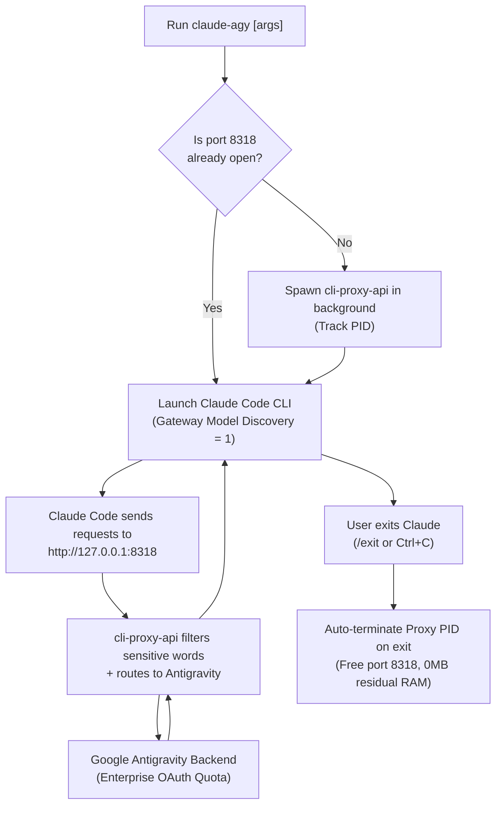

# Claude Code + Antigravity OAuth Integration (`claude-agy`)

This skill provides a complete automated guide, operations runbook, and architectural reference for running **Anthropic's Claude Code CLI** powered by **Google Antigravity OAuth** quotas instead of direct paid Anthropic API keys.

Fully supports **Linux** (Ubuntu/Debian/WSL), **macOS**, and fresh **Windows 10/11** workstations.

---

## 🏗️ Architecture & Execution Flow



---

## 💡 Design Philosophy: KISS & YAGNI

The system is designed strictly following **KISS** (Keep It Simple, Stupid) and **YAGNI** (You Aren't Gonna Need It) principles:
1. **Zero Redundant Aliases**: Instead of maintaining fragile static model alias tables, the system enables `CLAUDE_CODE_ENABLE_GATEWAY_MODEL_DISCOVERY="1"`.
2. **Dynamic Model Discovery (`/model`)**: Claude Code dynamically queries the upstream proxy (`GET /v1/models`). In the chat interface, engineers simply type `/model` to visually select between `claude-sonnet-4-6`, `claude-opus-4-6-thinking`, `gemini-3.8-flash-high`, and other models.
3. **Radical Minimalist Configuration**: The `config.yaml` file maintains only core settings: listening port, auth directory, and the `antigravity.sensitive-words` filter to completely prevent Google Cloud 429 quota exhaustion errors.

---

## 🚀 One-Click Installation

### 🌟 Universal 1-File Setup (Recommended: Windows, Linux, macOS)
Use the pure Node.js installer (Zero External Dependencies) for consistent installation across all platforms:

```bash
# Run directly from repository
node skills/claude-agy/scripts/setup.mjs
```

Or run directly via network with a single command:
```bash
curl -fsSL https://raw.githubusercontent.com/tuquet/tuquet-skills/main/skills/claude-agy/scripts/setup.mjs | node
```

*Universal Setup Highlights:*
- **100% Native Node.js**: Fully compatible with Windows 10/11, macOS, and Linux.
- **Dynamic Multi-Source Token Resolver**: Automatically detects OAuth tokens from Antigravity CLI (`antigravity-cli`), Antigravity IDE (`jetski-standalone-oauth-token`), and OAuth credentials (`oauth_creds.json`).
- **Resilient Proxy & Gateway Support**: Auto-detects corporate firewalls and corporate web gateways.
- **Automated Launcher & PATH Configuration**: Generates launcher binaries and scripts and exposes them globally on system PATH.

---

### 🪟 Windows (Scoop Package Manager - Recommended for Windows Developers)
If Scoop is installed on your workstation:

```powershell
# 1. Add Tuquet Scoop Bucket
scoop bucket add tuquet https://github.com/tuquet/tuquet-scoop-bucket

# 2. Install Claude-Agy
scoop install claude-agy
```
*Benefits:* Automatic dependency management (`nodejs-lts`), automatic shims, persistent tokens/config across version updates in `~/scoop/persist/claude-agy`, and one-command upgrades via `scoop update claude-agy`.

---

### 🪟 Windows 10 / 11 (Direct PowerShell Script)
Open **PowerShell** (or Windows Terminal) and run:

```powershell
irm https://raw.githubusercontent.com/tuquet/tuquet-skills/main/skills/claude-agy/scripts/setup.ps1 | iex
```

*Windows Installer Highlights:*
- Automatically checks & installs Node.js LTS (via `winget` if missing).
- Automatically installs `@anthropic-ai/claude-code`.
- Downloads `cli-proxy-api.exe` binary for Windows AMD64.
- **100% Pure PowerShell & Strict ASCII**: Zero Python requirement, decoding JWT tokens and syncing OAuth credentials natively without encoding issues.
- Creates `claude-agy.cmd` wrapper and adds to User `PATH` (usable from CMD, PowerShell, and Git Bash).

---

### 🐧 Linux / Ubuntu / Debian / WSL
Open your terminal and run:

```bash
curl -fsSL https://raw.githubusercontent.com/tuquet/tuquet-skills/main/skills/claude-agy/scripts/setup.sh | bash
```

*Linux Installer Highlights:*
- Automatically installs required dependencies (`curl`, `tar`, `netcat`, `python3`).
- Automatically bypasses Claude Code root execution restrictions (`IS_SANDBOX=1`).
- Exposes system-wide command via `/usr/local/bin/claude-agy` symlink.

---

## 📁 Standard Application Directory Layout

The application is cleanly packaged and isolated:

```text
# Linux: ~/claude-agy/  |  Windows: %USERPROFILE%\claude-agy\
├── bin/
│   ├── claude-agy            # Primary launcher script (Linux bash / Windows ps1 & cmd)
│   └── cli-proxy-api         # Reverse proxy binary (Linux elf / Windows .exe)
├── config/
│   ├── config.yaml           # Minimalist proxy configuration (KISS & YAGNI)
│   └── settings.env          # Environment settings (port, auto-bypass permission, default model)
├── data/
│   └── antigravity-auth.json # Synced OAuth credentials from Antigravity CLI
├── logs/
│   └── proxy.log             # Proxy runtime logs
├── scripts/
│   ├── sync-token.py / .ps1  # Automated token synchronization script
│   └── uninstall.sh / .ps1   # Clean uninstallation script
├── uninstall.sh / .ps1       # Root shortcut for quick uninstallation
└── README.md
```

---

## ⚙️ Minimalist Configuration (`config/config.yaml`)

```yaml
host: "127.0.0.1"
port: 8318
auth-dir: "/root/claude-agy/data"  # Or C:/Users/.../data on Windows
api-keys:
  - "sk-personal-claude-token"
remote-management:
  disable-control-panel: true
quota-exceeded:
  switch-project: true
  antigravity-credits: true
debug: false

# CRITICAL: Filter sensitive system words to prevent 429 RESOURCE_EXHAUSTED from Google backend
antigravity:
  sensitive-words:
    - "system-conventions"
    - "system_conventions"
    - "system-directive"
    - "system_directive"
    - "Claude Agent SDK"
    - "Claude Code"
    - "Anthropic"
    - "claude"
    - "API"
    - "proxy"
```

---

## 🛡️ Permission Bypass Techniques (Root & Unattended CI/CD)

### The Issue:
When running `--dangerously-skip-permissions` on Linux as `root`, Claude Code blocks execution:
```text
--dangerously-skip-permissions cannot be used with root/sudo privileges for security reasons
```

### Technical Solution:
1. **Environment Variable `IS_SANDBOX="1"`**:
   By analyzing Claude Code's bytecode:
   ```javascript
   isRootOutsideDeliberateSandbox() {
     return this.sources.platform !== "win32"
       && this.sources.getuid() === 0
       && !this.sources.isSandboxEnvSet()      // <-- process.env.IS_SANDBOX === "1"
       && !this.sources.isBubblewrapEnvSet();
   }
   ```
   When `IS_SANDBOX="1"`, Claude Code assumes execution occurs within an isolated container/sandbox and allows bypassing interactive confirmation.

2. **Automated Dialog Acceptance in `~/.claude.json`**:
   The installer pre-configures `~/.claude.json`:
   ```json
   {
     "bypassPermissionsModeAccepted": true,
     "hasCompletedOnboarding": true,
     "projects": {
       "<project-path>": { "hasTrustDialogAccepted": true }
     }
   }
   ```
   Enables 100% zero-touch execution, ideal for CI/CD automation and headless pipelines.

---

## ⚡ Cheatsheet & Command Reference

| Action | Inside Claude Code Chat | Or from Terminal |
| :--- | :--- | :--- |
| **List & select model** | `/model` (interactive picker) | `claude-agy --model <model-name>` |
| **Use default Sonnet** | `/model claude-sonnet-4-6` | `claude-agy` (Sonnet default) |
| **Use Opus Thinking** | `/model claude-opus-4-6-thinking`| `claude-agy --model claude-opus-4-6-thinking` |
| **Use Gemini 3.8 Flash**| `/model gemini-3.8-flash-high` | `claude-agy --model gemini-3.8-flash-high` |
| **Set reasoning effort** | `/effort high` / `medium` / `low` | `claude-agy --effort high` |
| **Run one-shot command** | - | `claude-agy -p "Write fibonacci in Rust"` |
| **Restore permission prompts** | - | `claude-agy --no-bypass` |

---

## 🗑️ Clean Uninstallation

### On Windows:
```powershell
# If installed via Scoop:
scoop uninstall claude-agy

# If installed via direct script:
& "$env:USERPROFILE\claude-agy\uninstall.ps1"
```

### On Linux:
```bash
~/claude-agy/uninstall.sh
```

---

## 🔧 Troubleshooting

1. **Error `429 RESOURCE_EXHAUSTED`:**
   - *Cause:* Google backend filters Claude-specific system prompts.
   - *Fix:* Ensure `antigravity.sensitive-words` is present in `config/config.yaml`.
2. **Port 8318 Already in Use (`Address already in use`):**
   - *Linux:* `pkill -f "cli-proxy-api.*8318"`
   - *Windows:* `Get-Process cli-proxy-api | Stop-Process -Force`
3. **Failed to Sync OAuth Token:**
   - Ensure you have logged into Google Antigravity CLI at least once to generate credentials at `~/.gemini/antigravity-cli/antigravity-oauth-token` or `~/.gemini/jetski-standalone-oauth-token`.
   - If missing, trigger a login session: `cli-proxy-api --config config/config.yaml -antigravity-login`.
