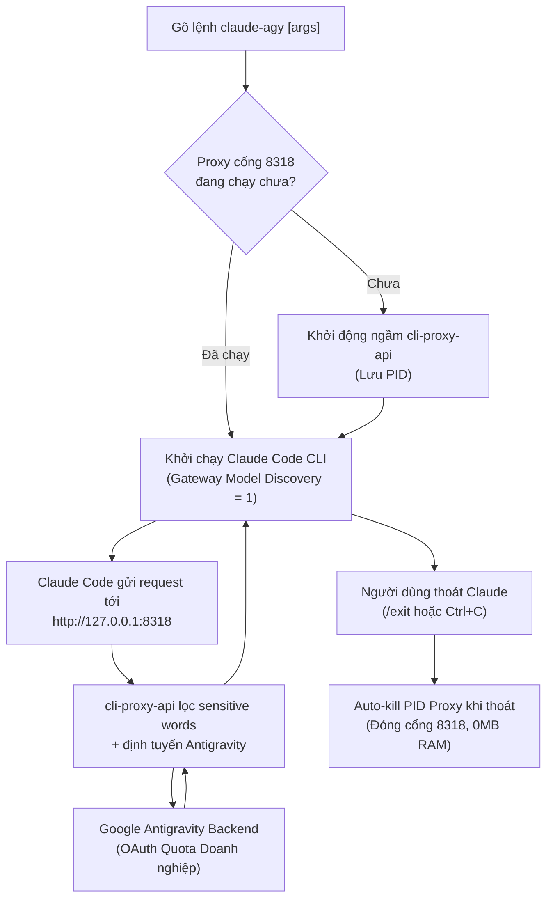

# Claude Code + Antigravity OAuth Integration (`claude-agy`)

Kỹ năng này hướng dẫn toàn bộ quy trình thiết lập tự động, vận hành và quản lý khi chạy **Claude Code CLI** bằng tài khoản **Google Antigravity OAuth** thay vì dùng token trả phí trực tiếp của Anthropic.

Hỗ trợ đầy đủ cả máy chủ **Linux** (Ubuntu/Debian/WSL) và máy trạm **Windows 10/11** mới tinh.

---

## 🏗️ Kiến trúc & Luồng hoạt động



---

## 💡 Triết lý Thiết kế: KISS & YAGNI

Hệ thống được thiết kế tinh gọn theo nguyên tắc **KISS** (Keep It Simple, Stupid) và **YAGNI** (You Aren't Gonna Need It):
1. **Không cấu hình alias dư thừa**: Thay vì duy trì danh sách hàng chục alias ảo dễ lỗi thời, hệ thống kích hoạt cờ `CLAUDE_CODE_ENABLE_GATEWAY_MODEL_DISCOVERY="1"`.
2. **Dynamic Model Discovery (`/model`)**: Claude Code tự động truy vấn danh mục model thực tế từ proxy (`GET /v1/models`). Trong giao diện tương tác, kỹ sư chỉ cần gõ `/model` để xem và chọn trực quan giữa `claude-sonnet-4-6`, `claude-opus-4-6-thinking`, `gemini-3.8-flash-high`, v.v.
3. **Cấu hình tối giản**: File `config.yaml` chỉ giữ lại các thành phần cốt lõi: cổng lắng nghe, thư mục auth, và bộ lọc từ khóa nhạy cảm `antigravity.sensitive-words` để ngăn chặn triệt để lỗi 429 quota từ Google Cloud.

---

## 🚀 Cài đặt Nhanh 1 Lệnh (One-Click Setup)

### 🌟 Universal 1-File Setup (Khuyên Dùng: Windows, Linux, macOS)
Sử dụng script Node.js thuần (Zero External Dependencies) để cài đặt đồng nhất trên mọi nền tảng:

```bash
# Chạy trực tiếp từ repository
node skills/claude-antigravity/scripts/setup.mjs
```

Hoặc chạy trực tiếp qua mạng bằng 1 dòng lệnh duy nhất:
```bash
curl -fsSL https://raw.githubusercontent.com/tuquet/tuquet-skills/main/skills/claude-antigravity/scripts/setup.mjs | node
```

*Đặc điểm Universal Setup:*
- **100% Native Node.js**: Tương thích hoàn toàn Windows 10/11, macOS, Linux.
- **Dynamic Multi-Source Token Resolver**: Tự động nhận diện token từ cả Antigravity CLI (`antigravity-cli`), Antigravity IDE (`jetski-standalone-oauth-token`), và OAuth credentials (`oauth_creds.json`).
- **Resilient Proxy & Gateway Support**: Tải binary qua `curl` / `powershell` tự động vượt qua Corporate Web Gateway & Proxy mạng doanh nghiệp.
- **Tự động cấu hình Launcher & PATH**: Sinh binary/script launcher và phơi ra biến môi trường PATH toàn cục.

---

### 🪟 Trên Windows (Cài Đặt Qua Scoop - Khuyên Dùng Cho Developer)
Nếu máy đã cài Scoop:

```powershell
# 1. Thêm Tuquet Scoop Bucket
scoop bucket add tuquet https://github.com/tuquet/tuquet-scoop-bucket

# 2. Cài đặt Claude-Agy
scoop install claude-agy
```
*Lợi ích:* Quản lý trọn gói dependency `nodejs-lts`, shims tự động, bảo toàn token/config qua thư mục `persist`, nâng cấp 1 lệnh `scoop update claude-agy`.

---

### 🪟 Trên Windows 10 / 11 (PowerShell Script Trực Tiếp)
Mở **PowerShell** (hoặc Windows Terminal) và chạy:

```powershell
irm https://raw.githubusercontent.com/tuquet/tuquet-skills/main/skills/claude-antigravity/scripts/setup.ps1 | iex
```

*Đặc điểm bộ cài Windows:*
- Tự động kiểm tra & cài đặt Node.js LTS (qua `winget` nếu thiếu).
- Tự động cài đặt `@anthropic-ai/claude-code`.
- Tải binary `cli-proxy-api.exe` cho Windows AMD64.
- **Thuần PowerShell 100%**: Script đồng bộ token `sync-token.ps1` giải mã JWT và đồng bộ token OAuth không cần cài Python.
- Tự động tạo wrapper `claude-agy.cmd` và thêm vào User `PATH` (chạy được trong CMD, PowerShell, Git Bash).

---

### 🐧 Trên Linux / Ubuntu / Debian / WSL
Mở terminal và chạy:

```bash
curl -fsSL https://raw.githubusercontent.com/tuquet/tuquet-skills/main/skills/claude-antigravity/scripts/setup.sh | bash
```

*Đặc điểm bộ cài Linux:*
- Tự động cài đặt gói phụ thuộc cơ bản (`curl`, `tar`, `netcat`, `python3`).
- Tự động bypass giới hạn root của Claude Code (`IS_SANDBOX=1`).
- Phơi lệnh toàn hệ thống qua symlink `/usr/local/bin/claude-agy`.

---

## 📁 Cấu trúc Thư mục Ứng dụng Chuẩn

Toàn bộ ứng dụng được đóng gói gọn gàng, cách ly hoàn toàn theo chuẩn đóng gói ứng dụng:

```text
# Trên Linux: ~/claude-agy/  |  Trên Windows: %USERPROFILE%\claude-agy\
├── bin/
│   ├── claude-agy            # Launcher script chính (Linux bash / Windows ps1 & cmd)
│   └── cli-proxy-api         # Binary reverse proxy (Linux elf / Windows .exe)
├── config/
│   ├── config.yaml           # Cấu hình proxy tối giản (KISS & YAGNI)
│   └── settings.env          # Cài đặt (cổng, auto bypass permission, model mặc định)
├── data/
│   └── antigravity-auth.json # Token OAuth đồng bộ từ Antigravity CLI
├── logs/
│   └── proxy.log             # Log runtime proxy
├── scripts/
│   ├── sync-token.py / .ps1  # Script đồng bộ token tự động
│   └── uninstall.sh / .ps1   # Script gỡ cài đặt sạch sẽ
├── uninstall.sh / .ps1       # Shortcut gỡ cài đặt nhanh tại thư mục gốc
└── README.md
```

---

## ⚙️ Cấu hình Tối giản (`config/config.yaml`)

```yaml
host: "127.0.0.1"
port: 8318
auth-dir: "/root/claude-agy/data"  # Hoặc C:/Users/.../data trên Windows
api-keys:
  - "sk-personal-claude-token"
remote-management:
  disable-control-panel: true
quota-exceeded:
  switch-project: true
  antigravity-credits: true
debug: false

# RẤT QUAN TRỌNG: Lọc từ khóa nhạy cảm chống mã lỗi 429 RESOURCE_EXHAUSTED từ Google Backend
antigravity:
  sensitive-words:
    - "system-conventions"
    - "system_conventions"
    - "system-directive"
    - "system_directive"
    - "Claude Agent SDK"
    - "Claude Code"
    - "Anthropic"
    - "claude"
    - "API"
    - "proxy"
```

---

## 🛡️ Kỹ thuật Bypass Permission (Root & Unattended CI/CD)

### Vấn đề:
Khi chạy cờ `--dangerously-skip-permissions` trên Linux với user `root`, Claude Code sẽ chặn:
```text
--dangerously-skip-permissions cannot be used with root/sudo privileges for security reasons
```

### Giải pháp kỹ thuật:
1. **Biến môi trường `IS_SANDBOX="1"`**:
   Phân tích mã nguồn bytecode của Claude Code:
   ```javascript
   isRootOutsideDeliberateSandbox() {
     return this.sources.platform !== "win32"
       && this.sources.getuid() === 0
       && !this.sources.isSandboxEnvSet()      // <-- process.env.IS_SANDBOX === "1"
       && !this.sources.isBubblewrapEnvSet();
   }
   ```
   Khi `IS_SANDBOX="1"`, Claude Code coi phiên làm việc đã nằm trong sandbox bảo vệ và cho phép bỏ qua xác nhận.

2. **Chấp thuận Dialog tự động trong `.claude.json`**:
   Script cấu hình tự động ghi vào `~/.claude.json`:
   ```json
   {
     "bypassPermissionsModeAccepted": true,
     "hasCompletedOnboarding": true,
     "projects": {
       "<project-path>": { "hasTrustDialogAccepted": true }
     }
   }
   ```
   Giúp công cụ chạy hoàn toàn không cần can thiệp bàn phím (zero-touch), lý tưởng cho CI/CD pipelines.

---

## ⚡ Bảng Lệnh Tiện ích (Cheatsheet)

| Bạn muốn làm | Trong khung chat Claude Code | Hoặc từ Terminal |
| :--- | :--- | :--- |
| **Xem & chọn model** | `/model` (hiện danh sách đầy đủ) | `claude-agy --model <model-name>` |
| **Dùng Sonnet mặc định** | `/model claude-sonnet-4-6` | `claude-agy` (mặc định sonnet) |
| **Dùng Opus Thinking** | `/model claude-opus-4-6-thinking`| `claude-agy --model claude-opus-4-6-thinking` |
| **Dùng Gemini 3.8 Flash**| `/model gemini-3.8-flash-high` | `claude-agy --model gemini-3.8-flash-high` |
| **Chỉnh mức suy luận** | `/effort high` / `medium` / `low` | `claude-agy --effort high` |
| **Chạy 1 lệnh rồi thoát** | - | `claude-agy -p "Viết hàm fibonacci"` |
| **Bật lại hỏi quyền** | - | `claude-agy --no-bypass` |

---

## 🗑️ Hướng dẫn Gỡ Cài Đặt (Clean Uninstallation)

### Trên Windows:
```powershell
& "$env:USERPROFILE\claude-agy\uninstall.ps1"
```

### Trên Linux:
```bash
~/claude-agy/uninstall.sh
```

---

## 🔧 Xử lý Sự cố Thường gặp (Troubleshooting)

1. **Lỗi `429 RESOURCE_EXHAUSTED`:**
   - *Nguyên nhân:* Google backend chặn các từ khóa hệ thống của Claude.
   - *Khắc phục:* Kiểm tra xem mục `antigravity.sensitive-words` đã có trong `config/config.yaml` chưa.
2. **Cổng 8318 bị chiếm (`Address already in use`):**
   - *Linux:* `pkill -f "cli-proxy-api.*8318"`
   - *Windows:* `Get-Process cli-proxy-api | Stop-Process -Force`
3. **Chưa đồng bộ được Token:**
   - Đảm bảo bạn đã từng đăng nhập Google Antigravity CLI ít nhất một lần để tạo file token tại `~/.gemini/antigravity-cli/antigravity-oauth-token`.
   - Nếu chưa có, chạy lệnh login: `cli-proxy-api --config config/config.yaml -antigravity-login`.
