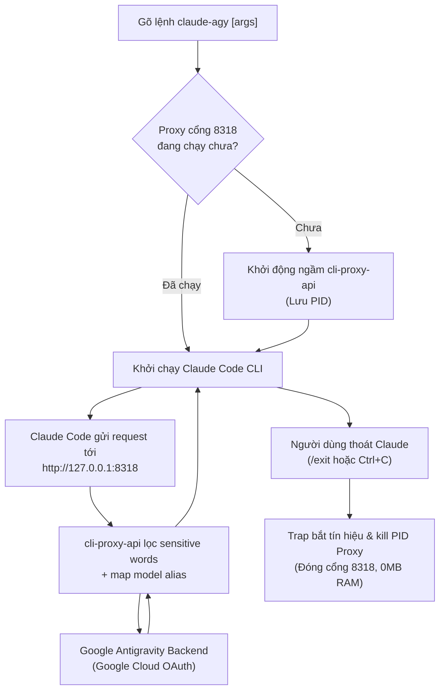

# Claude Code + Antigravity OAuth Integration (`claude-agy`)

Kỹ năng này hướng dẫn toàn bộ quy trình thiết lập, vận hành và sửa lỗi khi chạy **Claude Code CLI** bằng tài khoản **Google Antigravity OAuth** thay vì dùng token trả phí trực tiếp của Anthropic.

---

## 🏗️ Kiến trúc & Luồng hoạt động



---

## 🚀 Thiết lập trên máy mới (Từ số 0 đến dùng được)

### Bước 1: Yêu cầu môi trường (Prerequisites)
Đảm bảo máy có Node.js >= 18, npm, curl, tar, netcat (`nc`), và python3:
```bash
sudo apt-get update && sudo apt-get install -y curl tar netcat-openbsd python3
# Kiểm tra Node.js
node -v && npm -v
```

### Bước 2: Cài đặt Claude Code CLI
```bash
npm install -g @anthropic-ai/claude-code
claude --version
```

### Bước 3: Cài đặt Binary `cli-proxy-api`
Tải bản phát hành mới nhất từ repo `router-for-me/CLIProxyAPI`:
```bash
CPA_VERSION="7.3.17"
ARCH=$(uname -m) # linux_amd64 hoặc linux_aarch64
curl -sSL "https://github.com/router-for-me/CLIProxyAPI/releases/download/v${CPA_VERSION}/CLIProxyAPI_${CPA_VERSION}_linux_amd64.tar.gz" | tar -xz -C /tmp
mkdir -p /root/claude-agy/bin
mv /tmp/cli-proxy-api /root/claude-agy/bin/cli-proxy-api
chmod +x /root/claude-agy/bin/cli-proxy-api
```

### Bước 4: Cấu trúc thư mục ứng dụng chuẩn
Để tránh rác hệ thống, toàn bộ cấu hình, data, log và script được đóng gói trong:
```text
/root/claude-agy/
├── bin/
│   ├── claude-agy            # Launcher script chính
│   └── cli-proxy-api         # Binary reverse proxy
├── config/
│   ├── config.yaml           # Cấu hình proxy & model alias
│   └── settings.env          # Cài đặt ứng dụng (Bypass permission, model mặc định)
├── data/
│   └── antigravity-auth.json # Token OAuth
├── logs/
│   └── proxy.log             # Log proxy
├── scripts/
│   └── sync-token.py         # Script đồng bộ token tự động
├── install.sh                # Script cài đặt / gỡ cài đặt
└── uninstall.sh              # Shortcut gỡ cài đặt
```

### Bước 5: Cấu hình `config/config.yaml`
```yaml
host: "127.0.0.1"
port: 8318
auth-dir: "/root/claude-agy/data"
api-keys:
  - "sk-personal-claude-token"
remote-management:
  disable-control-panel: true
quota-exceeded:
  switch-project: true
  antigravity-credits: true
debug: false

# RẤT QUAN TRỌNG: Tránh bị Google backend chặn 429 RESOURCE_EXHAUSTED
antigravity:
  sensitive-words:
    - "system-conventions"
    - "system_conventions"
    - "system-directive"
    - "system_directive"
    - "Claude Agent SDK"
    - "Claude Code"
    - "Anthropic"
    - "claude"
    - "API"
    - "proxy"

# Bảng Alias model & fallback mapping
oauth-model-alias:
  antigravity:
    - name: "gemini-3.8-flash-high"
      alias: "3.8"
    - name: "gemini-3.8-flash-high"
      alias: "3.8-high"
    - name: "gemini-3.7-flash-high"
      alias: "3.7"
    - name: "claude-opus-4-6-thinking"
      alias: "opus"
    - name: "claude-sonnet-4-6"
      alias: "sonnet"
    - name: "claude-opus-4-6-thinking"
      alias: "claude-opus-4-8"
    - name: "claude-opus-4-6-thinking"
      alias: "claude-opus-4-7"
    - name: "claude-opus-4-6-thinking"
      alias: "claude-opus-4-6"
    - name: "claude-sonnet-4-6"
      alias: "claude-sonnet-5"
    - name: "claude-sonnet-4-6"
      alias: "claude-sonnet-4-5"
    - name: "claude-sonnet-4-6"
      alias: "claude-3-7-sonnet-20250219"
    - name: "claude-sonnet-4-6"
      alias: "claude-3-7-sonnet"
    - name: "claude-sonnet-4-6"
      alias: "claude-3-5-sonnet-20241022"
    - name: "gemini-3.8-flash-high"
      alias: "claude-3-5-haiku-20241022"
    - name: "gemini-3.8-flash-high"
      alias: "claude-haiku-4-5"
```

### Bước 6: Đồng bộ OAuth Token
Nếu máy đã cài Google Antigravity CLI, token nằm ở:
`~/.gemini/antigravity-cli/antigravity-oauth-token`

Đoạn mã Python đồng bộ sang `data/antigravity-auth.json`:
```python
import json, os, time, base64

gemini_path = os.path.expanduser("~/.gemini/antigravity-cli/antigravity-oauth-token")
auth_path = "/root/claude-agy/data/antigravity-auth.json"

with open(gemini_path) as f:
    data = json.load(f)

tok = data.get("token", {})
id_tok = data.get("id_token", "")
email = "user@antigravity"
if id_tok and "." in id_tok:
    payload = id_tok.split(".")[1]
    p = json.loads(base64.urlsafe_b64decode(payload + "==").decode("utf-8"))
    email = p.get("email", email)

auth_data = {
    "type": "antigravity",
    "email": email,
    "access_token": tok.get("access_token", ""),
    "refresh_token": tok.get("refresh_token", ""),
    "expires_in": 3600,
    "timestamp": int(time.time() * 1000),
    "expired": tok.get("expiry", "")
}
with open(auth_path, "w") as f:
    json.dump(auth_data, f, indent=2)
```

*(Nếu máy chưa có token sẵn, chạy: `/root/claude-agy/bin/cli-proxy-api --config /root/claude-agy/config/config.yaml -antigravity-login`)*.

---

## 🛡️ Kỹ thuật Bypass Permission (Đặc trị tài khoản root)

### Vấn đề:
Khi chạy cờ `--dangerously-skip-permissions` trên Linux với user `root`, Claude Code sẽ từ chối:
`--dangerously-skip-permissions cannot be used with root/sudo privileges for security reasons`

### Cách khắc phục:
1. **Biến môi trường `IS_SANDBOX="1"`**:
   Hàm kiểm tra `sw.isRootOutsideDeliberateSandbox()` trong mã bytecode của Claude Code:
   ```javascript
   isRootOutsideDeliberateSandbox() {
     return this.sources.platform !== "win32"
       && this.sources.getuid() === 0
       && !this.sources.isSandboxEnvSet()      // <-- process.env.IS_SANDBOX === "1"
       && !this.sources.isBubblewrapEnvSet();
   }
   ```
   Do đó, chỉ cần gán:
   ```bash
   export IS_SANDBOX="1"
   ```
   Claude Code sẽ nhận định môi trường đã được sandbox và cho phép dùng `--dangerously-skip-permissions` bình thường.

2. **Tự động chấp thuận Dialog trong `~/.claude.json`**:
   Thiết lập:
   ```json
   {
     "bypassPermissionsModeAccepted": true,
     "projects": {
       "/root": { "hasTrustDialogAccepted": true }
     }
   }
   ```
   Sẽ không bao giờ xuất hiện hộp thoại cảnh báo rủi ro khi khởi chạy.

---

## ⚡ Các lệnh gọi tắt (Cheatsheet)

| Bạn muốn dùng | Lệnh trong khung chat Claude Code | Hoặc lệnh từ Terminal |
| :--- | :--- | :--- |\n| **Gemini 3.8 Flash** | `/model 3.8` | `claude-agy --model 3.8` |
| **Gemini 3.8 Flash High** | `/model 3.8-high` | `claude-agy --model 3.8-high` |
| **Claude Sonnet 4.6** | `/model sonnet` | `claude-agy --model sonnet` |
| **Claude Opus Thinking** | `/model opus` | `claude-agy --model opus` |
| **Chỉnh mức suy luận** | `/effort high` / `medium` / `low` | `claude-agy --effort high` |
| **Chạy 1 lần (print)** | - | `claude-agy -p "Nhiệm vụ..."` |
| **Bật hỏi quyền** | - | `claude-agy --no-bypass` |

---

## 🔧 Xử lý sự cố thường gặp (Troubleshooting)

1. **Lỗi `429 RESOURCE_EXHAUSTED`:**
   * **Nguyên nhân:** Bộ lọc Google phát hiện từ khóa trong system prompt của Claude.
   * **Cách xử lý:** Đảm bảo mục `antigravity.sensitive-words` đã được cấu hình trong `config.yaml`.
2. **Lỗi `400 unknown provider for model ...`:**
   * **Nguyên nhân:** Phiên bản Claude Code mới tự gọi các model thế hệ mới (ví dụ `claude-sonnet-5`, `claude-opus-4-8`).
   * **Cách xử lý:** Thêm alias map model đó về `claude-sonnet-4-6` hoặc `gemini-3.8-flash-high` trong `oauth-model-alias`.
3. **Cổng 8318 bị chiếm (`Address already in use`):**
   * **Cách xử lý:** `fuser -k 8318/tcp` hoặc `pkill -f "cli-proxy-api.*8318"`.
4. **Token hết hạn:**
   * **Cách xử lý:** Chạy `python3 /root/claude-agy/scripts/sync-token.py` để lấy token mới nhất từ Antigravity CLI.
